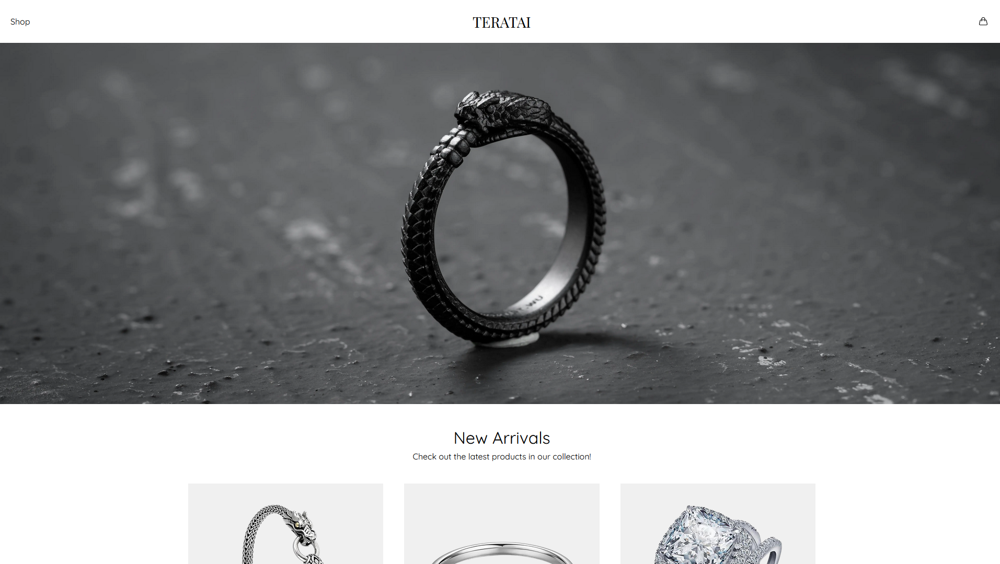

<h1 align="center">
  Shopping Cart
  <h4 align="center">A simple shopping cart application built with React</h4>
</h1>

## 🚀 Live Site

The live site can be viewed [here](https://shopping-cart-orokidd.vercel.app/).

## 📝 Project Description

The [project specification](https://www.theodinproject.com/lessons/node-path-react-new-shopping-cart) describes the general instructions in doing the project. This project primarily served as practice for understanding: React with React Router
